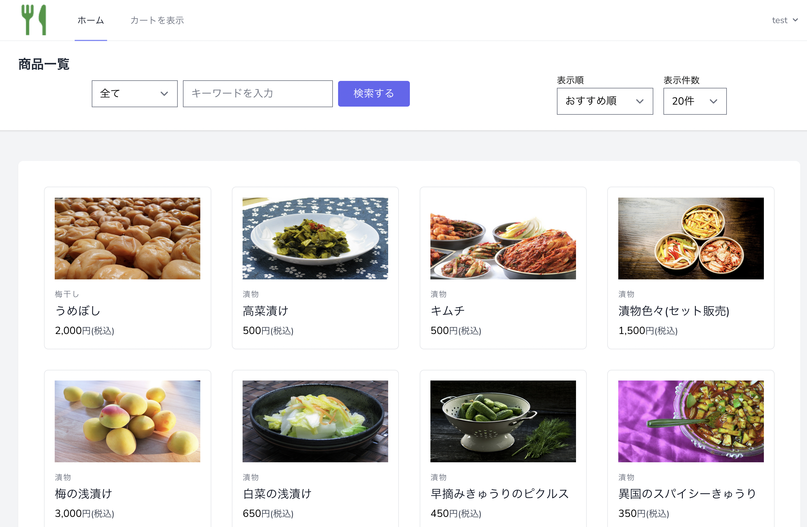
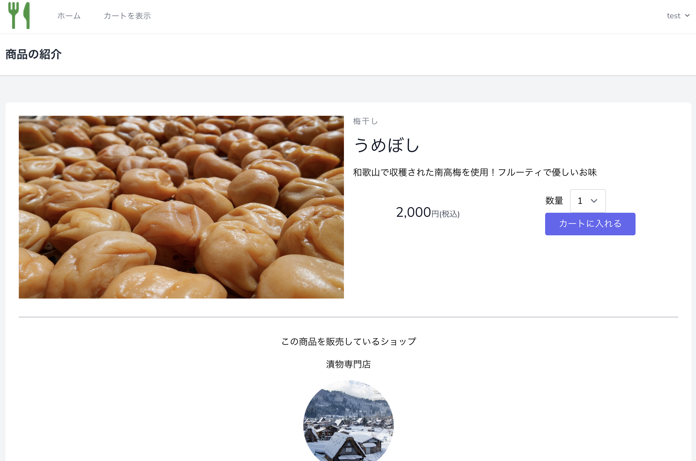
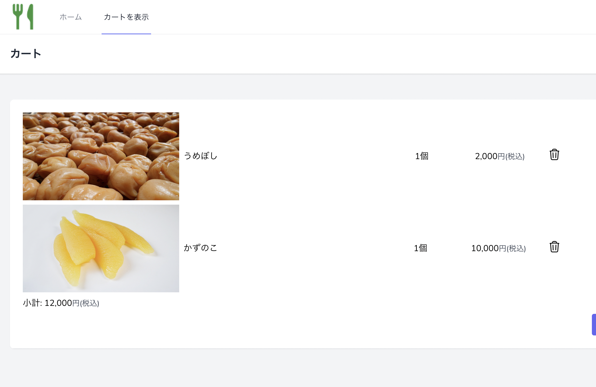
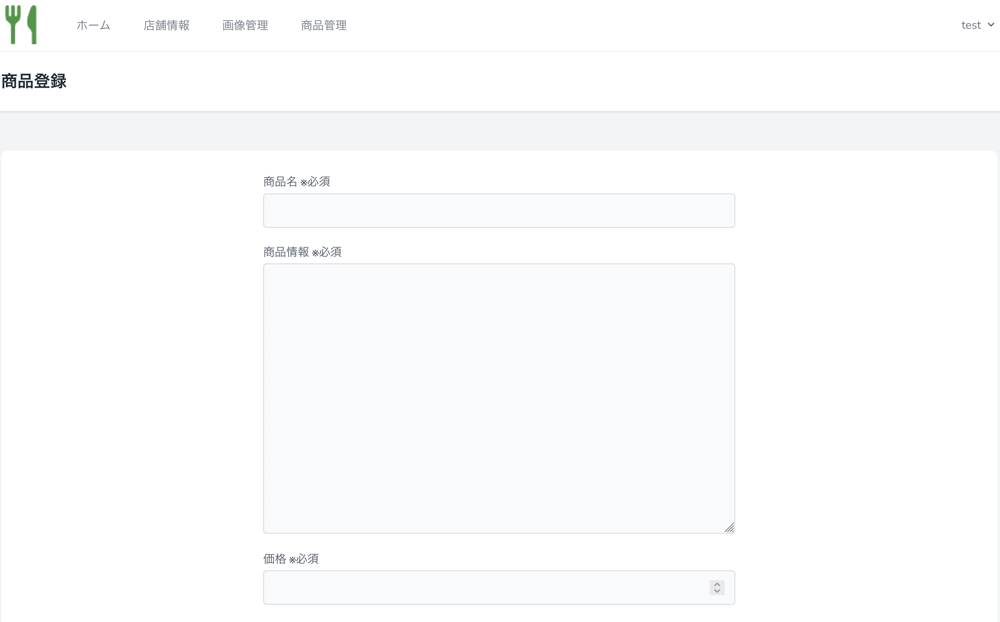
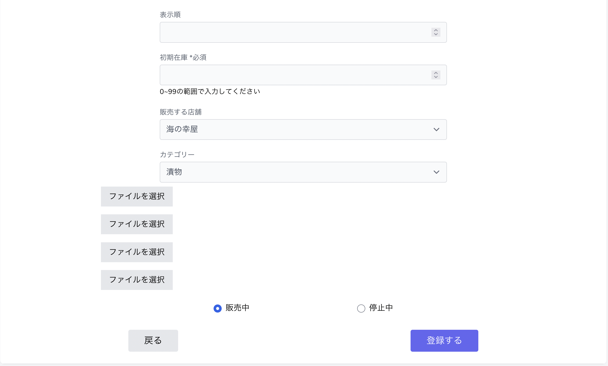
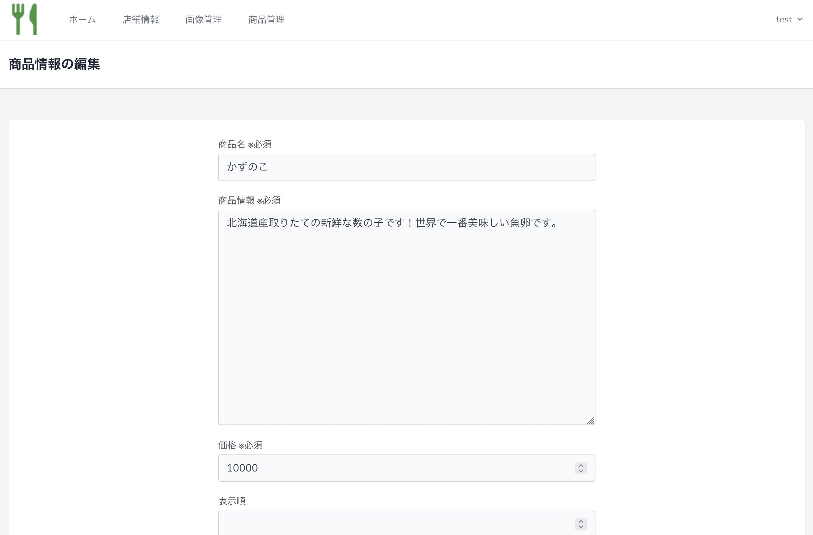

# Hoshimo

 漬物系/海鮮系専門のお店を持ち、販売できるECサイトです。 
 オーナーごとにお店の管理機能があり、消費者は商品検索機能などを使いながら、それぞれのオーナーから商品を購入することが出来ます。  

# 画面一覧
## ユーザー側
商品一覧画面です。 
カテゴリーや任意のキーワードで検索でき、ソート機能やページネーションの使用も可能です。

商品詳細画面です。 
その商品を販売している店舗の情報も確認することが出来ます。 

買い物カゴの画面です。 
購入ボタンを押すとstripe決済画面に進み、 
商品の購入が完了すると、購入者と購入された商品のオーナーの両者に購入完了の旨を知らせるメールが届きます。 

### オーナー側画面
商品一覧画面です 

商品登録画面です 
商品の販売情報(販売中/停止中)を選ぶことができ、停止中を選んだ場合はユーザー側の商品一覧には表示されません。 
こちらの画面とは別に画像の新規登録画面があり、 
そちらで登録した画像の中から、使用する画像を選択します。 

商品情報の変更画面です。 

以上の他に、店舗情報編集画面があります。  

### 使用技術
- PHP 8.2.5
- Laravel 8.83.27
- MySQL 5.7.39
- tailwindcss

### 機能一覧
- ユーザー登録 / ログイン機能
- 商品をカテゴリー/キーワードで検索
- ページネーション
- カートに追加 / 削除
- stripe処理
- 購入時メール受信機能
- オーナー登録　/　ログイン機能
- 店舗情報作成　/ 更新
- 商品画像登録 / 削除
- 商品登録 / 更新 / 削除
- 購入された際に商品内容をメールで受信

※メール機能に関してはmailtrapを使用しています。
